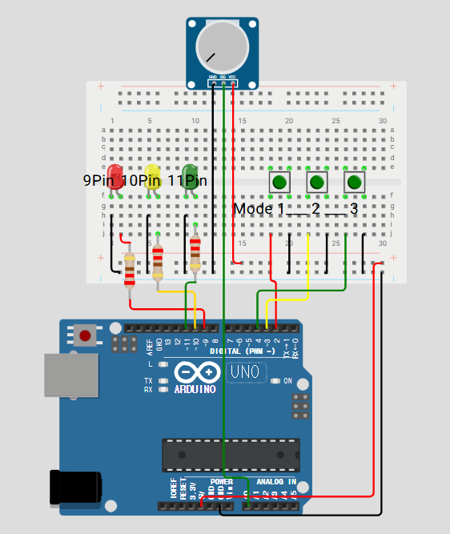

# Arduino Traffic Light System

## 프로젝트 개요
이 프로젝트는 **Arduino 기반의 신호등 시스템**을 구현하는 것으로, **TaskScheduler** 라이브러리를 활용하여 다양한 모드를 지원합니다.  
버튼을 눌러 LED를 제어하며, **가변저항**을 이용해 LED의 밝기를 조절할 수 있습니다.

## 회로 구성
아래는 신호등 시스템을 위한 회로 구성도입니다.

### 사용 부품
- **Arduino 보드**
- **LED 3개** (빨강, 노랑, 초록)
- **푸시 버튼 3개** (모드 변경용)
- **가변저항** (LED 밝기 조절용)
- **저항 220Ω 3개**
- **브레드보드 및 점퍼 와이어**

### 핀 연결

| 부품       | 핀 번호 |
|------------|--------|
| 빨간 LED   | D9     |
| 노란 LED   | D10    |
| 초록 LED   | D11    |
| 버튼 B1    | D2 `INPUT_PULLUP`    |
| 버튼 B2    | D3 `INPUT_PULLUP`    |
| 버튼 B3    | D4 `INPUT_PULLUP`    |
| 가변저항   | A0     |

## 기능 설명

### 1. 기본 신호등 모드
1. **빨간 LED** 켜짐 (`redTime` 지속) → 꺼짐  
2. **노란 LED** 켜짐 (`yellowTime` 지속) → 꺼짐
3. **초록 LED** 켜짐 (`greenTime` 지속) → **깜빡임 후 꺼짐**  
4. 다시 **1단계로 반복**  

1) `tRedLED`:   Red LED 켜고 redTime 동안 유지 → 끄고
2) `tYellowLED`: Yellow LED 켜고 yellowTime 동안 유지 → 끄고
3) `tGreenLED`:  Green LED 켜고 greenTime 동안 유지 → 끄고
4) `tGreenBlink`: Green LED를 3회 깜빡임
5) `tYellowLED2`: Yellow LED 켜고 yellowTime 동안 유지 후 다시 1)로 복귀

### 2. 버튼 조작 모드
| 버튼  | 기능 설명 | MODE | INTERRUPT |
|-------|--------------------------------| ------ | ---- |
| **B1** | **빨간 불 점등 모드 (토글 방식)** | EMERGENCY | FALLING |
| **B2** | **모든 LED가 깜빡이는 모드 (토글 방식)** | BLINKING | FALLING |
| **B3** | **모든 LED 소등 후 기본 모드로 복귀 ()** | ON / OFF | FALLING |

### 3. 가변저항 조정
- **가변저항(A0)** 을 사용하여 **LED 밝기(0~255)** 를 조절할 수 있습니다.

### 4. 시리얼 입력 기능
- **시리얼 모니터를 통해 신호 변경 시간** (`redTime`, `yellowTime`, `greenTime`)을 조정할 수 있습니다.