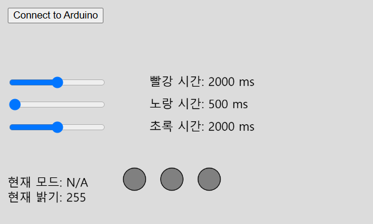

# 아두이노와 통신 [ p5.js + Web Serial ]

## 개요
- **p5.js와 Web Serial API**를 사용하여 **Arduino 기반의 신호등 시스템**과 통신을 구현합니다.  
- 슬라이더를 통해 신호등의 점등 시간을 조절하고, 버튼을 눌러 **Arduino와 연결**하여 실시간으로 데이터를 주고받을 수 있습니다.

## 주요 기능
- **Arduino 연결:** 웹 브라우저에서 버튼을 눌러 Arduino와 직렬 통신 연결
- **신호등 제어:** p5.js에서 신호등 상태를 표시하고, 슬라이더를 이용해 점등 시간 조절
- **실시간 데이터 송수신:** 슬라이더 값을 **Arduino로 전송**, 신호등 상태를 **Arduino에서 수신**
- **Web Serial API 활용:** 웹 기반에서 시리얼 통신을 통해 아두이노와 연동

## 실행 방법
1. **Arduino에 코드 업로드**
    - git clone https://github.com/Step-By-Step-Code/ESC
    - build Projects/class_1  and upload your arduino board 

2. **웹 페이지 실행**
   - p5.js 기반의 웹 페이지를 실행 (`index.html`)
   - **Arduino 연결 버튼 클릭**

## UI 설명

- **슬라이더**: 빨강, 노랑, 초록 신호등 점등 시간 설정 (`500ms ~ 3500ms`)
- **Connect 버튼**: Arduino와 웹 브라우저를 연결
- **신호등 UI**: 실시간으로 밝기, 모드, 점등시간, 신호등 상태를 화면에 표시