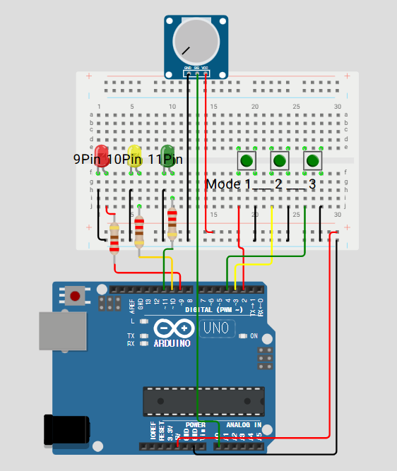

# Arduino Traffic Light System

## 프로젝트 개요
이 프로젝트는 **Arduino 기반의 신호등 시스템**을 구현하는 것으로, **TaskScheduler** 라이브러리를 활용하여 다양한 모드를 지원합니다.  
버튼을 눌러 LED를 제어하며, **가변저항**을 이용해 LED의 밝기를 조절할 수 있습니다.

## 추가된 부분 설명

### 시리얼 통신 기능 개선
기존 코드에서는 시리얼 통신을 통해 3개의 변수(LED 점등 주기)를 수신하여 조절하는 방식이었습니다. 이를 개선하여, **4개의 변수(3개의 LED 점등 주기 및 Mode 값)** 를 수신하도록 변경하였습니다.

### 주요 변경 사항
1. **Mode 값을 추가로 수신**
   - 기존 코드에서는 **Red, Yellow, Green LED의 점등 주기(시간)만 조절**할 수 있었습니다.
   - 새로운 코드에서는 **Mode 값도 입력받아 변경할 수 있도록 개선**되었습니다.

2. **Mode 변경 방식**
   - 수신된 Mode 값이 현재 Mode 값과 다를 경우, 새로운 Mode로 변경됩니다.
   - 현재 Mode와 동일하면 Mode 변경 없이 기존 상태를 유지합니다.
   - Mode 변경 시, 버튼을 눌렀을 때와 동일한 방식으로 실행되도록 구현하였습니다.

### 변경된 코드 (CheckSerial 함수)
```cpp
void CheckSerial() {
  if (Serial.available()) {
    String data = Serial.readStringUntil('\n');
    int newRed, newYellow, newGreen, newmode;
    if (sscanf(data.c_str(), "%d,%d,%d,%d", &newRed, &newYellow, &newGreen, &newmode) == 4) {
      redTime = newRed;
      yellowTime = newYellow;
      greenTime = newGreen;

      if (newmode != mode) { // 현재 Mode와 다를 경우 변경
        mode = newmode;
        if (mode == 1) { disableAllTasks(); tMode1.enable(); }
        else if (mode == 2) { disableAllTasks(); tBlinkAllLED.enable(); }
        else if (mode == 3) { disableAllTasks(); }
        else if (mode == 0) { disableAllTasks(); tRedLED.enable(); }
      }
    }
  }
}
```

### 추가된 기능 요약
- **시리얼 입력을 통해 Mode 변경 가능**
- **Mode 변경 시 기존 버튼 방식과 동일하게 동작**
- **같은 Mode 입력 시 기존 상태 유지**


## 회로 구성
아래는 신호등 시스템을 위한 회로 구성도입니다.



### 사용 부품
- **Arduino 보드**
- **LED 3개** (빨강, 노랑, 초록)
- **푸시 버튼 3개** (모드 변경용)
- **가변저항** (LED 밝기 조절용)
- **저항 220Ω 3개**
- **브레드보드 및 점퍼 와이어**

### 핀 연결

| 부품       | 핀 번호 |
|------------|--------|
| 빨간 LED   | D9     |
| 노란 LED   | D10    |
| 초록 LED   | D11    |
| 버튼 B1    | D2 `INPUT_PULLUP`    |
| 버튼 B2    | D3 `INPUT_PULLUP`    |
| 버튼 B3    | D4 `INPUT_PULLUP`    |
| 가변저항   | A0     |

## 기능 설명

### 1. 기본 신호등 모드
Default : redTime=2000, yellowTime=500, redTime=2000   

1) `tRedLED`: Red LED 켜고 redTime 동안 유지 → 끄고 -> 2) 실행
2) `tYellowLED`: Yellow LED 켜고 yellowTime 동안 유지 → 끄고 -> 3) 실행
3) `tGreenLED`:  Green LED 켜고 greenTime 동안 유지 → 끄고 -> 4) 실행
4) `tGreenBlink`: Green LED를 3회 깜빡임 -> 5) 실행
5) `tYellowLED2`: Yellow LED 켜고 yellowTime 동안 유지 후 다시 1)로 복귀

### 2. 버튼 조작 모드
**다시 누르면 기본동작으로 돌아갑니다**
| 버튼  | 기능 설명 | MODE | INTERRUPT |
|-------|--------------------------------| ------ | ---- |
| **B1** | **빨간 불 점등 모드 (토글 방식)** | EMERGENCY | FALLING |
| **B2** | **모든 LED가 깜빡이는 모드 (토글 방식)** | BLINKING | FALLING |
| **B3** | **모든 LED 소등 후 기본 모드로 복귀 ()** | ON / OFF | FALLING |

### 3. 가변저항 조정
- **가변저항(A0)** 을 사용하여 **LED 밝기(0~255)** 를 조절할 수 있습니다. 
- **[실시간 작동이 가능합니다]**
- **[모든 모드에서 작동합니다]**

### 4. 시리얼 통신 기능
- **시리얼 통신을 통해 점등 시간** (`redTime`, `yellowTime`, `greenTime`)을 조정할 수 있습니다. **[수신]**
- Mode, LED_1, LED_2, LED_3, LED Brightness를 **시리얼 통신**을 통해 **송신**합니다.