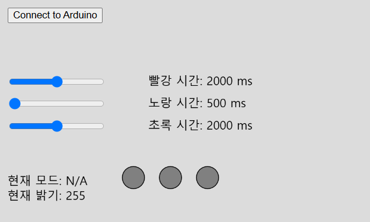

# 아두이노와 통신 [ p5.js + Web Serial ]

## 추가된 기능 설명

이 프로젝트는 기존 신호등 제어 기능에 **손 제스처 인식 기능**을 추가하여, 웹캠을 통해 특정 손동작을 감지하고 이를 기반으로 신호등을 제어할 수 있도록 개선되었습니다.

### ✅ 추가된 기능
- **손 제스처 인식 (ml5.js HandPose 활용)**  
  - 웹캠을 통해 손을 감지하고 특정 손동작을 분석하여 신호등을 제어할 수 있습니다.
- **제스처를 이용한 신호등 점등 시간 조정**  
  - 특정 제스처를 통해 빨강, 노랑, 초록 신호의 점등 시간을 조정할 수 있습니다.
- **UI 개선 (신호등 + 실시간 웹캠 화면 추가)**  
  - 기존 UI를 개선하여 **왼쪽에 신호등 UI, 오른쪽에 실시간 웹캠 화면**을 추가하였습니다.
- **슬라이더 값과 제스처 신호를 함께 아두이노로 전송**  
  - 기존 슬라이더 값 외에도 감지된 제스처 값을 함께 아두이노로 전송하여 제어할 수 있습니다.

---

## ✋ 사용 가능한 손 제스처

| Mode 0 | Mode 1 | Mode 2 | Mode 3 | 점등시간 ↑ | 점등시간 ↓ |
|--------|--------|--------|--------|-----------|-----------|
| 손등이 보이게 | 손바닥이 보이게 | 손등이 보이게 | 손바닥이 보이게 | OK 제스처 | Thumb down |
|  |  |  |  |  |  |

✅ 제스처 감지는 **1초마다 자동 감지**되며, 감지된 제스처는 아두이노로 전송됩니다.

---

## 📌 코드 주요 변경 사항

### 1️⃣ 제스처 인식 기능 추가
- `ml5.handPose`를 사용하여 웹캠에서 손을 감지하는 기능 추가.
- `gotHands(results)`를 통해 감지된 손의 좌표 데이터를 저장.
- `drawCamera()`에서 손의 keypoint를 화면에 표시.

### 2️⃣ 제스처 기반 신호 조정
- `determineGesture(hand)`를 통해 손동작을 분석하여 **6가지 제스처 구별**.
- `checkGesture()`가 1초마다 호출되어 감지된 제스처에 따라 슬라이더 값을 조정.

### 3️⃣ UI 개선
- 기존 캔버스를 **UI 영역(500px) + 카메라 영역(640px)** 으로 분리하여 1140px 화면 구성.

### 4️⃣ 아두이노 데이터 전송 방식 변경
- 기존 `sendData()`에서 슬라이더 값만 전송했지만,  
  `gestureSignal` 값을 추가하여 **제스처 신호도 함께 전송**하도록 개선.

```js
let data = `${redSlider.value()},${yellowSlider.value()},${greenSlider.value()},${gestureSignal}\n`;
```

## 개요
- **p5.js와 Web Serial API**를 사용하여 **Arduino 기반의 신호등 시스템**과 통신을 구현합니다.  
- 슬라이더를 통해 신호등의 점등 시간을 조절하고, 버튼을 눌러 **Arduino와 연결**하여 실시간으로 데이터를 주고받을 수 있습니다.

## 주요 기능
- **Arduino 연결:** 웹 브라우저에서 버튼을 눌러 Arduino와 직렬 통신 연결
- **신호등 제어:** p5.js에서 신호등 상태를 표시하고, 슬라이더를 이용해 점등 시간 조절
- **실시간 데이터 송수신:** 슬라이더 값을 **Arduino로 전송**, 신호등 상태를 **Arduino에서 수신**
- **Web Serial API 활용:** 웹 기반에서 시리얼 통신을 통해 아두이노와 연동

## 실행 방법
1. **Arduino에 코드 업로드**
    - git clone https://github.com/Step-By-Step-Code/ESC
    - build Projects/class_1  and upload your arduino board 

2. **웹 페이지 실행**
   - p5.js 기반의 웹 페이지를 실행 (`index.html`)
   - **Arduino 연결 버튼 클릭**

## UI 설명

- **슬라이더**: 빨강, 노랑, 초록 신호등 점등 시간 설정 (`500ms ~ 3500ms`)
- **Connect 버튼**: Arduino와 웹 브라우저를 연결
- **신호등 UI**: 실시간으로 밝기, 모드, 점등시간, 신호등 상태를 화면에 표시