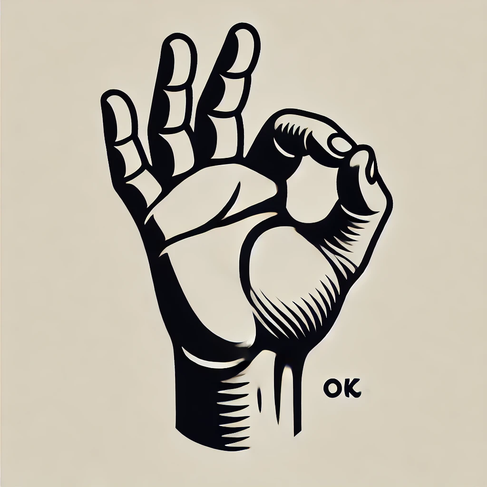
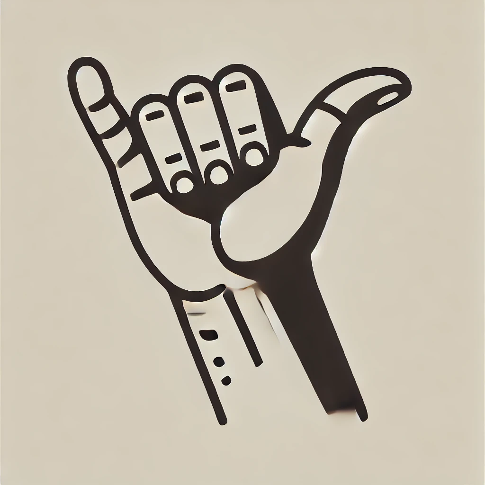
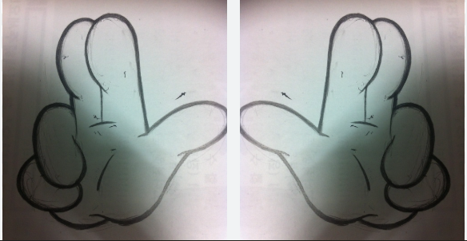
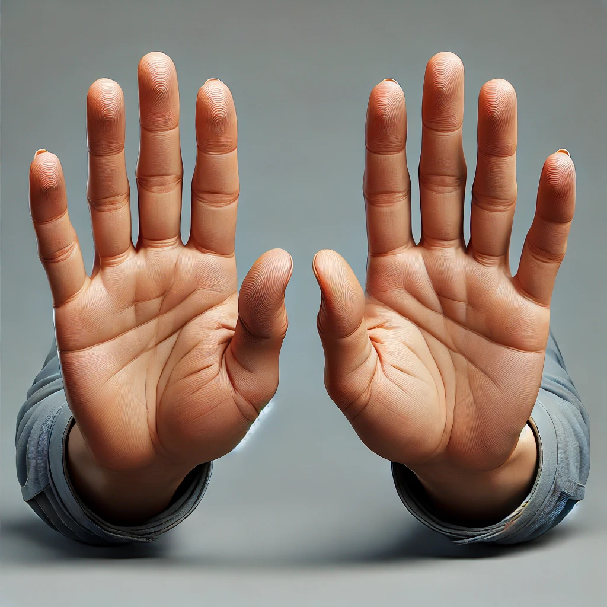
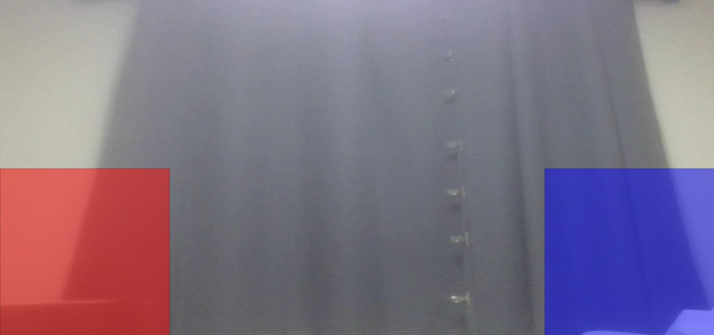
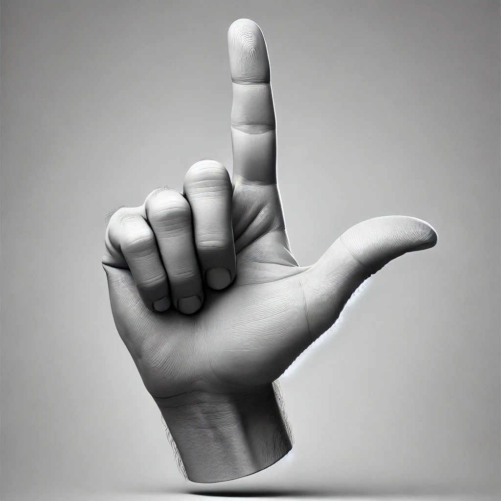

# Gesture-Based Interactive Drawing – README

## 제스처에 따른 동작 요약

- **OK 제스처**
  엄지와 검지 사이 거리가 가까우면서(OK 상태) 다른 손가락들이 펴져 있으면, 해당 엄지 팁과 검지 팁을 기준으로 선을 그립니다.


- **샤카(Shaka) 제스처**
  엄지와 새끼 손가락이 펴져 있고, 나머지 손가락들이 접혀 있으면 OK sign으로 그린 내용을 초기화합니다.


- **양손 일리네어 제스처 (손 두 개 이상)**  
  엄지, 검지, 중지가 펴진 상태를 인식하여, 두 개 이상의 손이 이 제스처를 보일 경우 화면을 흔들리게 합니다.

- **양손 오픈 핸드 제스처 (모든 손가락 펴짐, 손 두개 이상)**  
  모든 손가락이 펴지고 두 개 이상의 손인 경우, 흔들림 상태를 해제하고 기존에 그려진 파란색 및 빨간색 원들을 초기화합니다.
  

- **V 제스처 (엄지와 검지만 펴짐)**  
  엄지와 검지가 펴져 있고, 나머지 손가락이 접혀 있을 때 해당 손이 빨간 혹은 파란 사각형 내부에 위치한 동안 각각의 색상에 해당하는 원을 랜덤한 위치와 크기로 추가합니다.
  
  

## Gesture Recognition Functions
- 이 알고리즘은 손가락의 끝과 중간 마디가 손목과 얼마나 가까운지를 비교해 손가락이 접혔는지를 판단한다.
- 손가락 끝이 중간 마디보다 손목에 가까우면 해당 손가락은 접힌 상태로 간주된다.
- 장점 : 손의 방향과 상관없이 접힘 여부를 안정적으로 인식할 수 있다는 점이다.


### 1. isOkSign(hand)
**목적:**  
OK 제스처를 인식합니다.
- 엄지와 검지 사이의 거리가 특정 임계값 이하인지 확인  
- 중지, 약지, 소지 손가락이 펴진 상태인지 확인

**구현:**
```javascript
function isOkSign(hand) { // OK 제스처를 인식하는 함수
  let thumbTip = hand.keypoints[4];
  let indexTip = hand.keypoints[8];
  let d = dist(thumbTip.x, thumbTip.y, indexTip.x, indexTip.y); // 엄지와 검지 사이의 거리 계산
  let okThreshold = 55;

  let wrist = hand.keypoints[0];
  // 중지, 약지, 소지 손가락이 펴져 있는지 확인
  let middleExtended = dist(hand.keypoints[12].x, hand.keypoints[12].y, wrist.x, wrist.y) > 
                       dist(hand.keypoints[10].x, hand.keypoints[10].y, wrist.x, wrist.y);
  let ringExtended   = dist(hand.keypoints[16].x, hand.keypoints[16].y, wrist.x, wrist.y) > 
                       dist(hand.keypoints[14].x, hand.keypoints[14].y, wrist.x, wrist.y);
  let pinkyExtended  = dist(hand.keypoints[20].x, hand.keypoints[20].y, wrist.x, wrist.y) > 
                       dist(hand.keypoints[18].x, hand.keypoints[18].y, wrist.x, wrist.y);
  
  return (d < okThreshold && middleExtended && ringExtended && pinkyExtended);
}
```

---

### 2. isShakaSign(hand)
**목적:**  
샤카 제스처를 인식합니다.  
- 엄지와 새끼 손가락이 펴진 상태 확인  
- 검지, 중지, 약지 손가락은 접힌 상태인지 확인

**구현:**
```javascript
function isShakaSign(hand) { // 샤카 제스처를 인식하는 함수
  let wrist = hand.keypoints[0];

  // 엄지, 새끼 손가락이 펴져 있는지 확인
  let thumbExtended = dist(hand.keypoints[4].x, hand.keypoints[4].y, wrist.x, wrist.y) > 
                      dist(hand.keypoints[3].x, hand.keypoints[3].y, wrist.x, wrist.y);
  let pinkyExtended = dist(hand.keypoints[20].x, hand.keypoints[20].y, wrist.x, wrist.y) > 
                      dist(hand.keypoints[19].x, hand.keypoints[19].y, wrist.x, wrist.y);
  // 검지, 중지, 약지 손가락이 접혀 있는지 확인
  let indexFolded = dist(hand.keypoints[8].x, hand.keypoints[8].y, wrist.x, wrist.y) < 
                    dist(hand.keypoints[7].x, hand.keypoints[7].y, wrist.x, wrist.y);
  let middleFolded = dist(hand.keypoints[12].x, hand.keypoints[12].y, wrist.x, wrist.y) < 
                     dist(hand.keypoints[11].x, hand.keypoints[11].y, wrist.x, wrist.y);
  let ringFolded = dist(hand.keypoints[16].x, hand.keypoints[16].y, wrist.x, wrist.y) < 
                   dist(hand.keypoints[15].x, hand.keypoints[15].y, wrist.x, wrist.y);
  
  return (thumbExtended && pinkyExtended && indexFolded && middleFolded && ringFolded);
}
```

---

### 3. isThreeFingersExtended(hand)
**목적:**  
엄지, 검지, 중지가 펴진 상태를 인식합니다.  
- 나머지 두 손가락(약지, 소지)이 접혀 있는지 확인

**구현:**
```javascript
function isThreeFingersExtended(hand) { // 세 손가락 제스처를 인식하는 함수
  let wrist = hand.keypoints[0];
  // 엄지, 검지, 중지가 펴진 상태 확인
  let thumbExtended = dist(hand.keypoints[4].x, hand.keypoints[4].y, wrist.x, wrist.y) > 
                      dist(hand.keypoints[3].x, hand.keypoints[3].y, wrist.x, wrist.y);
  let indexExtended = dist(hand.keypoints[8].x, hand.keypoints[8].y, wrist.x, wrist.y) > 
                      dist(hand.keypoints[7].x, hand.keypoints[7].y, wrist.x, wrist.y);
  let middleExtended = dist(hand.keypoints[12].x, hand.keypoints[12].y, wrist.x, wrist.y) > 
                       dist(hand.keypoints[11].x, hand.keypoints[11].y, wrist.x, wrist.y);
  // 약지와 새끼가 접힌 상태 확인
  let ringFolded = dist(hand.keypoints[16].x, hand.keypoints[16].y, wrist.x, wrist.y) < 
                   dist(hand.keypoints[15].x, hand.keypoints[15].y, wrist.x, wrist.y);
  let pinkyFolded = dist(hand.keypoints[20].x, hand.keypoints[20].y, wrist.x, wrist.y) < 
                    dist(hand.keypoints[19].x, hand.keypoints[19].y, wrist.x, wrist.y);
  
  return (thumbExtended && indexExtended && middleExtended && ringFolded && pinkyFolded);
}
```

---

### 4. areAllFingersExtended(hand)
**목적:**  
모든 손가락이 펴진 오픈 핸드 제스처를 인식합니다.

**구현:**
```javascript
function areAllFingersExtended(hand) { // Open hand 제스처 인식 함수
  let wrist = hand.keypoints[0];
  // 모든 손가락이 펴져 있는지 확인
  let thumbExtended = dist(hand.keypoints[4].x, hand.keypoints[4].y, wrist.x, wrist.y) > 
                      dist(hand.keypoints[3].x, hand.keypoints[3].y, wrist.x, wrist.y);
  let indexExtended = dist(hand.keypoints[8].x, hand.keypoints[8].y, wrist.x, wrist.y) > 
                      dist(hand.keypoints[7].x, hand.keypoints[7].y, wrist.x, wrist.y);
  let middleExtended = dist(hand.keypoints[12].x, hand.keypoints[12].y, wrist.x, wrist.y) > 
                       dist(hand.keypoints[11].x, hand.keypoints[11].y, wrist.x, wrist.y);
  let ringExtended = dist(hand.keypoints[16].x, hand.keypoints[16].y, wrist.x, wrist.y) > 
                     dist(hand.keypoints[15].x, hand.keypoints[15].y, wrist.x, wrist.y);
  let pinkyExtended = dist(hand.keypoints[20].x, hand.keypoints[20].y, wrist.x, wrist.y) > 
                      dist(hand.keypoints[19].x, hand.keypoints[19].y, wrist.x, wrist.y);
  
  return (thumbExtended && indexExtended && middleExtended && ringExtended && pinkyExtended);
}
```

---

### 5. isThumbIndexExtended(hand)
**목적:**  
엄지와 검지만 펴진 V 제스처를 인식합니다.  
- 엄지와 검지가 확실히 펴진 상태인지 확인  
- 나머지 손가락(중지, 약지, 소지)이 접힌 상태인지 확인

**구현:**
```javascript
function isThumbIndexExtended(hand) { // V 제스처 인식 함수
  let wrist = hand.keypoints[0];
  // 엄지 손가락이 펴진지 확인
  let thumbExtended = dist(hand.keypoints[4].x, hand.keypoints[4].y, wrist.x, wrist.y) > 
                      dist(hand.keypoints[3].x, hand.keypoints[3].y, wrist.x, wrist.y);
  // 검지 손가락이 펴진지 확인
  let indexExtended = dist(hand.keypoints[8].x, hand.keypoints[8].y, wrist.x, wrist.y) > 
                      dist(hand.keypoints[7].x, hand.keypoints[7].y, wrist.x, wrist.y);
  // 중지, 약지, 소지 손가락이 접혀있는지 확인
  let middleFolded = dist(hand.keypoints[12].x, hand.keypoints[12].y, wrist.x, wrist.y) < 
                     dist(hand.keypoints[11].x, hand.keypoints[11].y, wrist.x, wrist.y);
  let ringFolded = dist(hand.keypoints[16].x, hand.keypoints[16].y, wrist.x, wrist.y) < 
                   dist(hand.keypoints[15].x, hand.keypoints[15].y, wrist.x, wrist.y);
  let pinkyFolded = dist(hand.keypoints[20].x, hand.keypoints[20].y, wrist.x, wrist.y) < 
                    dist(hand.keypoints[19].x, hand.keypoints[19].y, wrist.x, wrist.y);

  return (thumbExtended && indexExtended && middleFolded && ringFolded && pinkyFolded);
}
```

---

### 6. isHandInRedSquare(hand)
**목적:**  
손의 모든 키포인트가 빨간 사각형 영역(화면 왼쪽 아래)에 포함되는지 확인합니다.

**구현:**
```javascript
function isHandInRedSquare(hand) { // 손의 모든 키포인트가 빨간 상자 안에 있는지 확인
  let squareSize = height / 2;
  for (let i = 0; i < hand.keypoints.length; i++) {
    let keypoint = hand.keypoints[i];
    if (keypoint.x < 0 || keypoint.x > squareSize || keypoint.y < height - squareSize || keypoint.y > height) {
      return false;
    }
  }
  return true;
}
```

---

### 7. isHandInBlueSquare(hand)
**목적:**  
손의 모든 키포인트가 파란 사각형 영역(화면 오른쪽 아래)에 포함되는지 확인합니다.

**구현:**
```javascript
function isHandInBlueSquare(hand) {  // 손의 모든 키포인트가 파란 상자 안에 있는지 확인
  let squareSize = height / 2;
  for (let i = 0; i < hand.keypoints.length; i++) {
    let keypoint = hand.keypoints[i];
    if (keypoint.x < width - squareSize || keypoint.x > width || keypoint.y < height - squareSize || keypoint.y > height) {
      return false;
    }
  }
  return true;
}
```

---

## 추가: drawOkSign(hand, handIndex)
**목적:**  
OK 제스처를 인식했을 때, 엄지와 검지의 중간 지점을 계산하여 선을 그립니다.

**구현:**
```javascript
function drawOkSign(hand, handIndex) {
  // 엄지와 검지 끝의 중간 지점 계산
  let midX = (hand.keypoints[4].x + hand.keypoints[8].x) / 2;
  let midY = (hand.keypoints[4].y + hand.keypoints[8].y) / 2;
  let currentPoint = { x: midX, y: midY };
  
  // lastPoint가 존재하면 두 점을 연결하여 선을 그림
  if (lastPoints[handIndex]) {
    drawingLayer.stroke(255); // 흰색 선
    drawingLayer.strokeWeight(20); // 선 두께
    drawingLayer.line(lastPoints[handIndex].x, lastPoints[handIndex].y, currentPoint.x, currentPoint.y);
  }
  // 현재 점을 lastPoints 배열에 업데이트
  lastPoints[handIndex] = currentPoint;
}
```