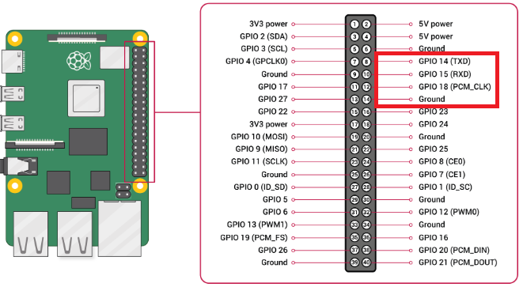
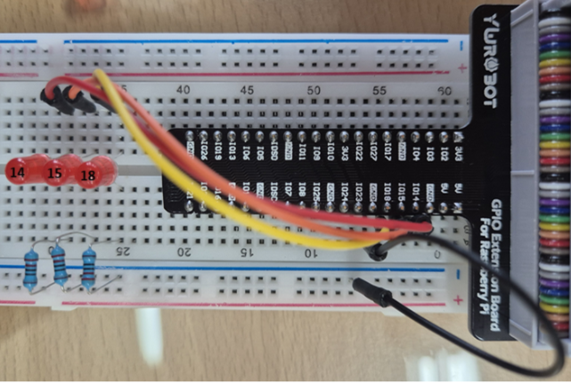

# Counter8 Homework explanation
이 스크립트는 3개의 GPIO 핀을 이용하여 0부터 7(총 8가지 상태)까지 3비트 이진 카운트를 구현합니다.  
각 카운트 값에 따라 해당 비트가 1이면 핀을 HIGH(`dh`)로, 0이면 LOW(`dl`)로 설정해 순차적으로 LED를 제어합니다.

## Counter8 Youtube Link CLICK [Here](https://www.youtube.com/shorts/m2OIx202eTc)

## 사용방법


## 핀맵 설명

| **GPIO 핀 번호** | **모드 설정** | **초기 상태** | **설명**                     |
|------------------|---------------|---------------|------------------------------|
| GPIO 14          | 출력 (op)     | LOW (dl)    | 제어 순서의 첫 번째 핀         |
| GPIO 15          | 출력 (op)     | LOW (dl)    | 제어 순서의 두 번째 핀         |
| GPIO 18          | 출력 (op)     | LOW (dl)    | 제어 순서의 세 번째 핀         |

## 회로 구성
- GPIO 14 : 빨강색 케이블
- GPIO 15 : 주황색 케이블
- GPIO 18 : 노란색 케이블



## 코드 구성과 설명

### 초기 설정
- 사용할 GPIO 핀 번호를 리스트로 정의합니다. (예: [14, 15, 18])
- 각 핀에 대해 LED 객체를 생성하여 제어할 수 있게 준비합니다.
- 각 LED는 초기화 시 자동으로 LOW(꺼짐) 상태로 설정됩니다.

```python
pins = [14, 15, 18]
leds = [LED(pin) for pin in pins]
```
### 종료 처리
- Ctrl+C 입력 시(혹은 SIGINT 수신 시) 모든 핀을 LOW 상태로 전환하여 LED를 끕니다.
- gpiozero의 off() 메서드를 이용해 안전하게 종료됩니다.

```python
def cleanup(signal_received, frame):
    for led in leds:
        led.off()
    print("Pins reset to LOW. Exiting.")
    sys.exit(0)

signal(SIGINT, cleanup)
```

### 메인 루프
- 0부터 7까지 순차적으로 값을 생성하여, 이를 3비트 이진수로 해석합니다.
- 각 비트에 따라 해당 GPIO 핀의 LED를 ON 또는 OFF합니다.
- 1초 간격으로 상태를 갱신하며 LED가 순차적으로 점등되도록 반복합니다.
- 0->1->2->3->4->5->6->7->0->반복
```python
while True:
    for count in range(8):
        for i in range(3):
            if (count >> i) & 1:
                leds[i].on()
            else:
                leds[i].off()
        sleep(1)
```