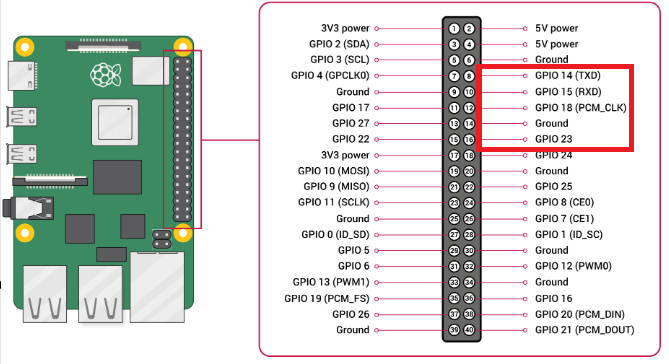

# Domino4 Homework explanation
GPIO 핀 14, 15, 18, 23을 배열에 저장한 후, 각 핀을 출력 모드로 설정하고 초기 상태를 LOW로 설정합니다. 무한 루프 내에서 각 핀을 순차적으로 HIGH로 전환한 후 1초 동안 대기하고 다시 LOW로 전환하여 핀의 상태를 변화시킵니다. 스크립트 종료 시 모든 핀을 LOW로 재설정하는 cleanup 함수를 호출하여 안전한 종료를 보장합니다.

## Domino4 Youtube Link CLICK [Here](https://www.youtube.com/watch?v=KlBhNfm7fUY)

## 핀맵 설명

| **GPIO 핀 번호** | **모드 설정** | **초기 상태** | **설명**                     |
|------------------|---------------|---------------|------------------------------|
| GPIO 14          | 출력 (op)     | LOW (dl)    | 제어 순서의 첫 번째 핀         |
| GPIO 15          | 출력 (op)     | LOW (dl)    | 제어 순서의 두 번째 핀         |
| GPIO 18          | 출력 (op)     | LOW (dl)    | 제어 순서의 세 번째 핀         |
| GPIO 23          | 출력 (op)     | LOW (dl)    | 제어 순서의 네 번째 핀         |

## 회로 구성
- GPIO 14 : 빨강색 케이블
- GPIO 15 : 주황색 케이블
- GPIO 18 : 노란색 케이블
- GPIO 18 : 초록색 케이블


## 코드 구성과 설명

### 초기 설정
- 정의된 각 pin에 대해 pinctrl set "핀번호" op 명령어로 해당 핀을 출력 모드(op)로 설정합니다.
-  pinctrl set "핀번호" dl 명령어로 LOW 상태(dl)로 초기화합니다
```bash
for pin in "${pins[@]}"; do
    pinctrl set "$pin" op
    pinctrl set "$pin" dl
done
```
### 종료 처리
- cleanup() 함수 내부에서 pins 배열에 포함된 모든 핀을 LOW 상태(dl)로 되돌립니다.
- trap cleanup EXIT 구문을 통해 스크립트가 종료될 때(정상 종료 또는 Ctrl+C 등 신호를 받을 때) cleanup() 함수가 자동으로 호출됩니다.

- 스크립트가 어떻게 종료되더라도 모든 핀을 LOW 상태로 안전하게 되돌려 줍니다.
```bash
cleanup() {
    for pin in "${pins[@]}"; do
        pinctrl set "$pin" dl
    done
    echo "Pins reset to LOW. Exiting."
}
trap cleanup EXIT
```

### 메인 루프
- 먼저 핀 배열(14, 15, 18, 23)에 따라 PIN 14 → PIN 15 → PIN 18 → PIN 23 순으로 ‘HIGH’ 상태가 되고, 각각 1초 후에 ‘LOW’ 상태로 되돌아갑니다.

- 모든 핀이 순서대로 켜졌다 꺼지는 과정을 한 번 수행하면 다시 PIN 14로 돌아가 동일한 순서를 반복합니다.
```bash
while true; do
    for pin in "${pins[@]}"; do
        pinctrl set "$pin" dh
        sleep 1
        pinctrl set "$pin" dl
    done
done
```