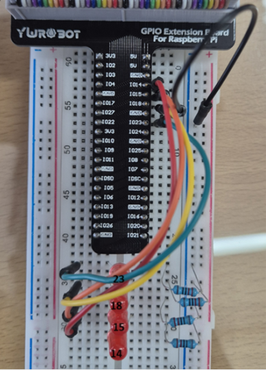

# Domino4 Homework explanation
GPIO 핀 14, 15, 18, 23을 배열에 저장한 후, 각 핀을 출력 모드로 설정하고 초기 상태를 LOW로 설정합니다. 무한 루프 내에서 각 핀을 순차적으로 HIGH로 전환한 후 1초 동안 대기하고 다시 LOW로 전환하여 핀의 상태를 변화시킵니다. 스크립트 종료 시 모든 핀을 LOW로 재설정하는 cleanup 함수를 호출하여 안전한 종료를 보장합니다.

## Domino4 Youtube Link CLICK [Here](https://www.youtube.com/watch?v=KlBhNfm7fUY)

## 핀맵 설명

| **GPIO 핀 번호** | **모드 설정** | **초기 상태** | **설명**                     |
|------------------|---------------|---------------|------------------------------|
| GPIO 14          | 출력 (op)     | LOW (dl)    | 제어 순서의 첫 번째 핀         |
| GPIO 15          | 출력 (op)     | LOW (dl)    | 제어 순서의 두 번째 핀         |
| GPIO 18          | 출력 (op)     | LOW (dl)    | 제어 순서의 세 번째 핀         |
| GPIO 23          | 출력 (op)     | LOW (dl)    | 제어 순서의 네 번째 핀         |

## 회로 구성
- GPIO 14 : 빨강색 케이블
- GPIO 15 : 주황색 케이블
- GPIO 18 : 노란색 케이블
- GPIO 23 : 초록색 케이블



## 코드 구성과 설명

### 초기 설정
- Python에서 gpiozero.LED 클래스를 사용해 GPIO 핀 번호(14, 15, 18, 23)를 각각 LED로 설정합니다.
-  각 LED는 초기화 시 자동으로 LOW(꺼짐) 상태로 설정됩니다.

```python
from gpiozero import LED

pin_numbers = [14, 15, 18, 23]
leds = [LED(pin) for pin in pin_numbers]
```

### 종료 처리
- 사용자가 Ctrl+C로 프로그램을 종료할 경우를 대비해 SIGINT 신호를 감지하여 모든 핀을 LOW 상태로 되돌립니다.
- signal 모듈을 통해 종료 시 정리 작업(cleanup)을 자동으로 수행하도록 구성합니다.

```python
from signal import signal, SIGINT
import sys

def cleanup(sig, frame):
    for led in leds:
        led.off()
    print("Pins reset to LOW. Exiting.")
    sys.exit(0)

signal(SIGINT, cleanup)
```

### 메인 루프
- 스크립트는 무한 루프를 돌며 PIN 14 → 15 → 18 → 23 순서로 하나씩 LED를 1초 동안 켠 뒤 끕니다.

- 모든 LED가 순차적으로 한 번씩 켜지고 꺼지는 사이클을 반복합니다.

```python
from time import sleep

while True:
    for led in leds:
        led.on()
        sleep(1)
        led.off()

```